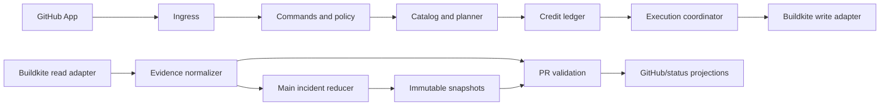

# vLLM `/ci` control plane

This directory contains the provider-neutral control-plane code for vLLM CI.
It is a separate package because it owns long-lived state and orchestration; it
does not belong in vLLM's test definitions or in the Buildkite pipeline
generator.

The design has three independent responsibilities:

1. **Control** — authorize, plan, account for, and dispatch requested work.
2. **Evidence** — continuously reconcile canonical `main` and PR results.
3. **Diagnosis** — compare one exact-HEAD PR run with one immutable `main`
   snapshot.

The first deployment should be a modular monolith with one transactional
database. GitHub comments, issues, and dashboards are projections, never the
database.

This package currently implements the strict grammar, policy, catalog/compiler,
planner, immutable credit transitions, provider adapters, evidence reduction,
incident lifecycle, snapshot validation, and tests. It does **not** deploy a
gateway or database. The ingestion, orchestration, and projection sections
below are the deployment contract for the next slice; mutation commands stay
disabled until that slice exists.

## User API

One exact command is accepted per PR comment. Unknown words fail parsing;
unknown catalog selectors fail planning. Neither case dispatches work.

### Read-only commands

| Command | Result |
| --- | --- |
| `/ci help` | Syntax, selectors, and examples. |
| `/ci status` | Current PR HEAD, latest runs, validation, `main` snapshot, and caller balance. |
| `/ci status pr` | Failures for the exact current PR HEAD, classified against one `main` snapshot. |
| `/ci status main` | Current failing, recovering, and recently resolved groups on canonical `main`. |
| `/ci status refresh` | Queue evidence reconciliation without rerunning tests. |
| `/ci status request:<id>` | Show one immutable request, provider operation, and cost. |
| `/ci list groups` | Selectable groups, initially `upstream`, `amd`, and `cpu`. |
| `/ci list areas` | Stable test-area names from the reviewed catalog. |
| `/ci list jobs` | Stable job keys and their group/area membership. |
| `/ci plan <selection>` | Exact jobs, dependency closure, and credit cost without dispatch. |
| `/ci credits` | Available, reserved, granted, and spent credits for the caller. |

### Compute commands

| Command | Result |
| --- | --- |
| `/ci run <selection>` | Run the selected dependency-closed plan for the exact current PR HEAD. |
| `/ci retry failures [<selection>]` | Retry each matching current failure once in its source-run lineage. |
| `/ci credits add @user <amount> <reason>` | Append an audited credit grant. CI grant administrators only. |

Examples:

```text
/ci run all
/ci run groups:amd,cpu
/ci run groups:upstream areas:attention,models
/ci retry failures groups:amd
/ci plan groups:cpu areas:models
/ci status main groups:amd
/ci credits add @alice 100 flaky AMD investigation
```

## Selectors

A selection is one of:

```text
all
groups:<group>[,<group>...]
areas:<area>[,<area>...] [groups:<group>[,<group>...]]
jobs:<stable-job-key>[,<stable-job-key>...]
```

Values in one field are ORed; different fields are ANDead. Overlap schedules a
job once. `all` cannot be combined with another selector.

Selectors resolve through a versioned catalog compiled from the protected
vLLM default branch. Every selectable entry has a stable key, groups, area,
execution variant, provider route, dependencies, shard count, and cost inputs.
Labels, commands, arbitrary provider IDs, branches, and SHAs are not accepted
as selectors.

Renames require an alias. Deletions require a tombstone. The planner rejects
unknown values, alias loops, key collisions, dependency cycles, incomplete
dependency closure, and empty intersections. Credit reservation rejects an
unaffordable complete plan. The validation action compiles both PR and base
catalogs, so compatibility records are enforced for job and area selectors
rather than merely documented.

The `amd` group initially combines individually keyed mirrored jobs with one
opaque `native-amd` lane. Area selection can target the mirrored jobs. The
legacy native AMD Jinja source does not yet provide stable per-job identities,
so its logical job/area always schedules the whole lane; selection of
individual native jobs remains disabled until that source is migrated or
explicitly keyed. A dedicated opaque-pipeline adapter checks the complete
provider job count and retry lineages; the direct step-key adapter cannot
silently consume this lane.

## Authorization and credits

Compute is fail-closed and limited to users whose live GitHub repository
permission is `write`, `maintain`, or `admin`. Read-only status can remain
public. Credit grants use a separately configurable, normally narrower
permission set, and the recipient must independently satisfy the compute
eligibility rule.

Each eligible user is lazily initialized with **300 job credits**. One planned
job or one retry costs one credit by default; policy may later assign reviewed
resource weights. Dependency and shard jobs are included in the quoted cost.

Credits use an append-only ledger:

```text
grant -> reserve whole plan -> dispatch -> settle actual work
                                  \-> reject/confirmed failure -> refund
                                  \-> unknown -> reconcile, never replay blindly
```

Balance checks and reservations are one transaction. A request either reserves
its full plan or schedules nothing. Comment delivery ID is the idempotency key,
so duplicate webhook delivery cannot spend twice.

`retry.failures_limit` accepts a non-negative integer or `inf`. Unlimited retry depth
does not mean unlimited compute: credits, exact-head checks, request caps, and
provider eligibility still apply.

## Main status and updates

Buildkite remains the source of run facts. The service ingests through:

- authenticated completion webhooks for low latency;
- scheduled overlapping reconciliation for missed or reordered events; and
- an explicit refresh request that queues the same reconciler.

The ingestor always fetches authoritative build and job data, including retry
lineage. One stable group on one distinct canonical `main` SHA becomes:

| Outcome | Meaning |
| --- | --- |
| `clean` | Every current shard passed on its first attempt. |
| `failed` | A current shard failed, timed out, expired, or soft-failed. |
| `flaky` | A failure was followed by a passing retry/rebuild on the same SHA. |
| `inconclusive` | Identity, shards, attempts, or a completed result are missing. |

Absence from a selective run is no evidence. One SHA contributes at most once
per canonical-main epoch; a retry or rebuild cannot satisfy a distinct-commit
threshold. Force-pushed history starts a new epoch, and a changed executable
definition starts a new incident identity, so counters cannot span either
boundary.

The default incident lifecycle is:

```text
first failing SHA       second failing SHA
healthy ──────────────> candidate ──────────────> known
                                                   │
                                  first clean SHA  ▼
                                               recovering 1/3
                                                   │
                                  third clean SHA  ▼
                                                resolved
```

A failure while recovering returns the incident to `known`. A resolved
incident requires the failure threshold again before reopening. Inconclusive,
missing, stale, or partial evidence never confirms or resolves an incident.
Thresholds are repository policy, not hard-coded state transitions.

When a known failure starts passing, the next complete snapshot therefore
shows `recovering`; after the clean threshold it shows `resolved`. The service
retains the evidence and transition history.

## PR validation

Validation pins all reads to:

- the PR's current full HEAD SHA;
- compatible catalog schemas plus each job's execution-definition digest; and
- one immutable `main` snapshot revision with per-lane watermarks.

The snapshot retains bounded canonical history. If current `main` is newer
than the PR base, a clean comparison uses the newest fresh compatible
observation that is actually in the pinned base ancestry. An additive,
unrelated catalog change therefore does not hide otherwise comparable jobs.

Every current PR failure is placed in exactly one section:

| Section | Required evidence |
| --- | --- |
| Known on `main` | Same compatible group and failure fingerprint are confirmed and currently failing. |
| Candidate on `main` | Same compatible fingerprint is currently failing but below confirmation threshold. |
| Seen flaky on `main` | Same fingerprint occurred in a complete retry lineage that eventually passed. |
| Recovering on `main` | A matching confirmed incident has fresh clean evidence below its resolution threshold. |
| Resolved on `main` | A matching incident reached its clean resolution threshold. |
| Different failure on `main` | The compatible group is red, but normalized fingerprints differ. |
| Group also red on `main` | The group is red, but no exact fingerprint comparison is available. |
| Not matched on `main` | The same compatible group ran clean in fresh positive evidence from the PR base ancestry. |
| Unable to classify | Missing key/run, incompatible catalog, stale/partial evidence, or lane absence. |

“Not matched on `main`” means a **possible** PR regression, not proof that the
PR caused it. Group-level matching also cannot prove that two different
assertions are the same failure. Adapters accept structured test-result
fingerprints when a lane produces them; otherwise validation says only that
the group is also red.

## Module boundaries



| Module | Owns |
| --- | --- |
| `commands` | Strict grammar and typed commands. |
| `policy` | Versioned authorization, quota, retry, and evidence thresholds. |
| `catalog` | Stable identities, selectors, aliases, tombstones, and dependency DAG. |
| `credits` | Grants, reservations, settlement, refunds, and ledger invariants. |
| `evidence` | Provider-neutral attempt and shard normalization. |
| `incidents` | Pure replayable `main` lifecycle reduction. |
| `validation` | Exact-HEAD comparison against one frozen snapshot. |
| `ports` | Current catalog, credit CAS, permission, and team interfaces; execution/evidence storage ports are the next slice. |
| `adapters` | Current GitHub, direct Buildkite, and opaque-lane Buildkite adapters; a transactional database adapter is next. |
| `application` | Planned request idempotency and orchestration across those ports. |

Only an owning module writes its tables. External mutations are recorded with
a unique operation key before calling the provider. A timeout stays `unknown`
until reconciliation proves whether work was accepted; it is never retried
blindly.

## Repository boundary

`ci-infra` owns the service, schemas, compiler, provider adapters, storage,
reconciliation, and deployment. `vllm` owns only:

- protected default-branch policy values;
- semantic group/area metadata and stable job keys;
- existing Buildkite test commands and dependencies;
- a SHA-pinned catalog validation workflow; and
- concise contributor documentation.

No Buildkite write token, credit balance, request state, incident state, or
controller Python belongs in the vLLM repository.

## Rollout

The safe landing order is:

1. package, policy/catalog validation, pure planner/ledger/reducer, and
   read-only shadow status;
2. transactional database, webhook receipts, provider-operation
   reconciliation, and live main snapshots;
3. credit grants and retry failures;
4. selected fresh runs after the generated pipeline consumes a pinned plan;
5. structured test fingerprints for test-level diagnosis.

Mutation commands remain disabled until steps 1–2 are deployed. An ephemeral
Actions file, cache, comment, or issue is not a safe implementation of the
300-credit ledger.
